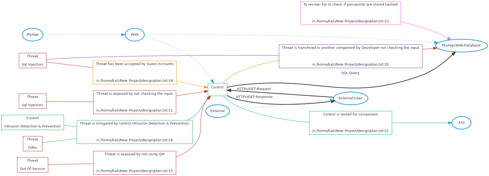

# Threatspec Project Threat Model

A threatspec project.


# Diagram



# Exposures

## Sql injection against MyApp:Web:Server
Not checking the input

```

```
/home/kali/New Project/design/plan.txt:11

## Out of service against MyApp:Web:Server
Not using idp

```

```
/home/kali/New Project/design/plan.txt:15


# Acceptances

## Sql injection to MyApp:Web:Server
Guest accounts

```

```
/home/kali/New Project/design/plan.txt:18


# Transfers


# Mitigations

## Ddos against MyApp:Web:Server mitigated by Intrusion detection & prevention


```

```
/home/kali/New Project/design/plan.txt:16


# Reviews

## MyApp:Web:Database
for to check if passwords are stored hashed

```

```
/home/kali/New Project/design/plan.txt:23


# Connections

## External:User To MyApp:Web:Server
HTTPs/GET-Request

```

```
/home/kali/New Project/design/plan.txt:5

## MyApp:Web:Server To External:User
HTTPs/GET-Response

```

```
/home/kali/New Project/design/plan.txt:6

## MyApp:Web:Server To MyApp:Web:Database
SQL Query

```

```
/home/kali/New Project/design/plan.txt:7


# Components

## XSS

## MyApp:Web:Server

## MyApp:Web:Database

## External:User


# Threats

## Ddos


## Sql injection


## Out of service


## Sql injection


# Controls

## 

## Intrusion detection & prevention
